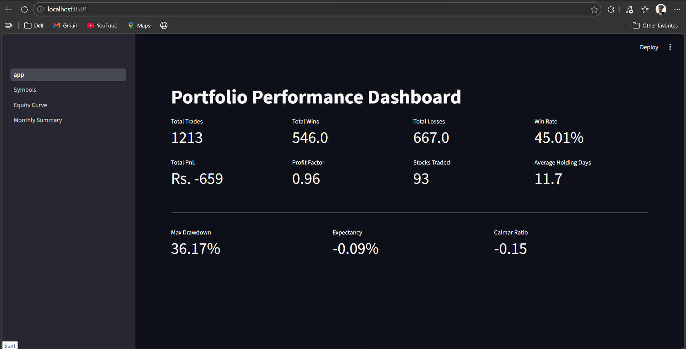
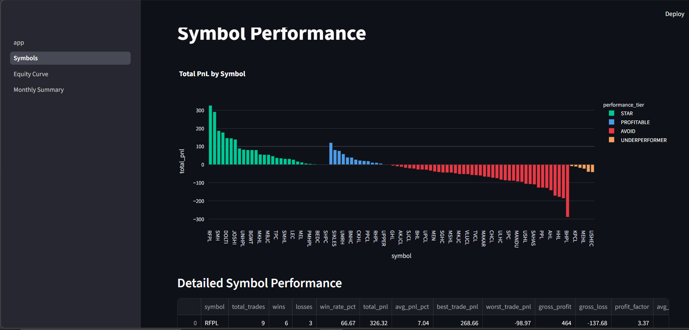
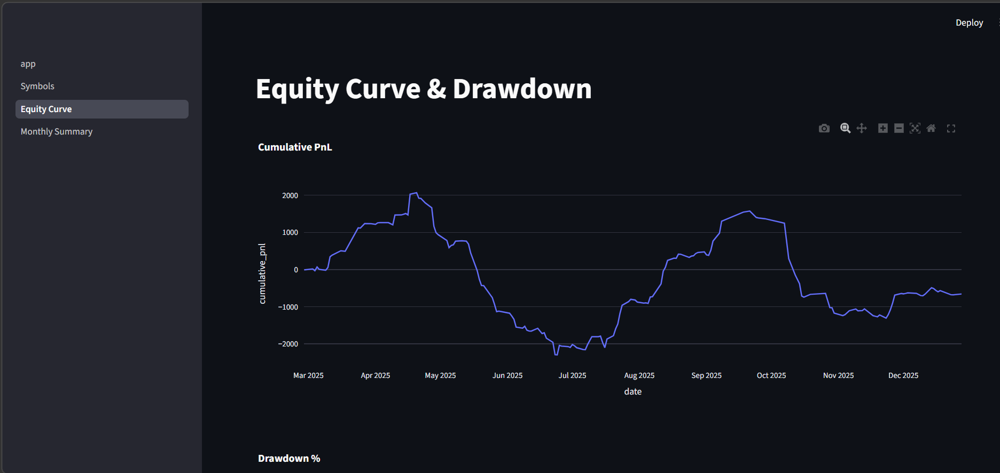
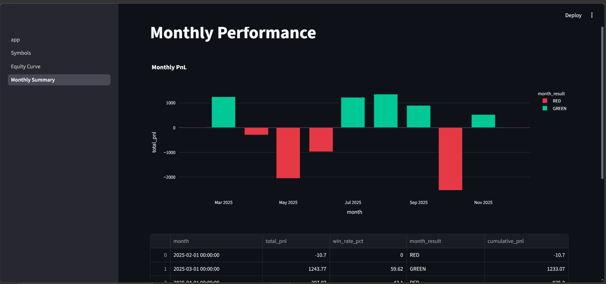

# Portfolio Performance

A production-style dbt project that models NEPSE stock trade data into a
full portfolio analytics data mart with an interactive Streamlit dashboard for visualization.

---

## Tech Stack

| Tool | Purpose |
|---|---|
| **dbt + DuckDB** | Transformation layer + local analytical database |
| **DuckDB** | Embedded, zero-config analytical database (portfolio.duckdb) |
| **dbt_utils** | Utilities for tests, helper macros, and date operations |
| **Streamlit** | Interactive web dashboard for portfolio visualization |
| **Python** | Data processing and visualization scripts |

---

## Project Structure

```
portfolio_performance/
├── models/              # dbt data transformation models
│   ├── staging/        # Raw data staging layer
│   ├── intermediate/   # Intermediate calculations
│   └── marts/          # Final analytics tables
├── tests/              # Data quality & validation tests
├── seeds/              # Seed CSV files (trades.csv, ohlc.csv)
├── macros/             # dbt macros & helpers
├── visualization/      # Streamlit dashboard app
│   ├── app.py         # Main dashboard
│   ├── db.py          # Database connection utilities
│   └── pages/         # Multi-page dashboard views
├── profiles.yml        # dbt connection configuration
└── dbt_project.yml     # dbt project settings
```

---

## Quick Start

### 1. Install dependencies
```bash
pip install -r requirements.txt
```

### 2. Install dbt packages
```bash
dbt deps
```

### 3. Initialize the data warehouse
```bash
dbt seed && dbt run && dbt test
```

### 4. View dbt documentation
```bash
dbt docs generate && dbt docs serve
```

### 5. Launch the Streamlit dashboard
```bash
streamlit run visualization/app.py
```

---

## Data Models

### Staging Layer (`models/staging/`)
- **stg_ohlc** — Normalized OHLC (Open, High, Low, Close) data
- **stg_trades** — Normalized trade records

### Intermediate Layer (`models/intermediate/`)
- **int_daily_equity** — Daily portfolio equity and returns
- **int_symbol_ohlc_stats** — Statistics per stock symbol
- **int_trade_metrics** — Calculated trade-level metrics

### Marts Layer (`models/marts/`)
| Table | Description |
|---|---|
| `mart_portfolio_summary` | Overall portfolio KPIs (Sharpe, Calmar, drawdown, profit factor) |
| `mart_symbol_performance` | Per-symbol performance metrics and rankings |
| `mart_daily_pnl` | Daily P&L, equity curve, and rolling metrics |
| `mart_monthly_performance` | Monthly performance summaries and trends |

---

## Data Quality Tests

Located in `tests/` and `models/*/schema.yml`:
- **Schema tests** — not_null, unique, relationships, accepted_values
- **Custom tests** — PnL consistency, entry/exit validation, portfolio constraints
- **Expression tests** — Data integrity checks (e.g., price > 0)

---

## Visualization Dashboard

The Streamlit app (`visualization/app.py`) provides:
- **1_Symbols.py** — Individual symbol performance analysis
- **2_Equity_Curve.py** — Portfolio equity and cumulative returns
- **3_Monthly_Summary.py** — Monthly performance & attribution

### Dashboard Screenshots

**Portfolio Summary**


**Symbol Analysis**


**Equity Curve**


**Monthly Performance**


---

## Key Metrics

- **Win Rate** — % of trades that were profitable
- **Profit Factor** — gross profit ÷ gross loss (target > 1.5)
- **Calmar Ratio** — return relative to maximum drawdown
- **Max Drawdown** — largest peak-to-trough equity decline
- **Expected Value** — average profit/loss per trade

---

## Database

The project uses **DuckDB** as its data warehouse:
- `portfolio.duckdb` — Main analytical database (auto-created on first run)
- Local, file-based, zero configuration required
